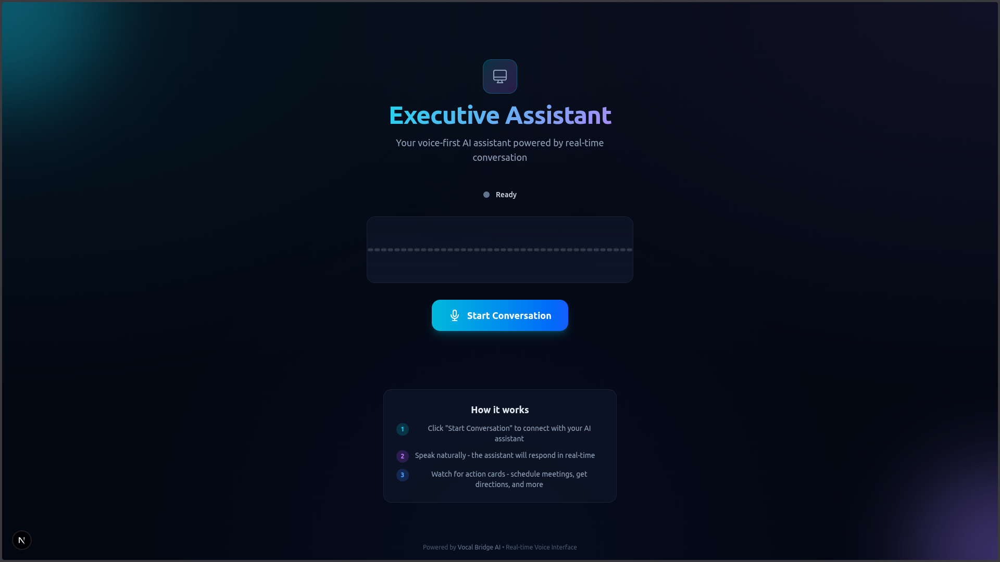

# Executive Assistant - Voice-First AI Dashboard  

A premium, futuristic voice-first executive assistant dashboard powered by **Vocal Bridge AI** and real-time WebRTC communication via LiveKit.



## ✨ Features

- **Real-time Voice Conversation**: Connect and speak naturally with your AI assistant
- **Audio Visualizer**: Beautiful real-time audio visualization showing agent/user speaking states
- **Client Actions**: Dynamic UI updates based on conversation context
  - Calendar event cards when meetings are scheduled
  - Maps/location cards for navigation
  - Extensible action system for custom widgets
- **Premium Dark Mode UI**: Futuristic "Jarvis-like" interface with glassmorphism effects
- **Robust Error Handling**: Graceful connection state management and error recovery

## 🚀 Getting Started

### Prerequisites

- Node.js 18+ 
- npm/yarn/pnpm
- Vocal Bridge API Key

### Installation

1. **Clone the repository**:
   ```bash
   git clone <repository-url>
   cd executive-assistant-web
   ```

2. **Install dependencies**:
   ```bash
   npm install
   ```

3. **Configure environment variables**:
   ```bash
   cp .env.local.example .env.local
   ```
   
   Edit `.env.local` and add your Vocal Bridge API key:
   ```env
   VOCAL_BRIDGE_API_KEY=your_api_key_here
   VOCAL_BRIDGE_URL=https://vocalbridgeai.com/api/v1
   ```

4. **Run the development server**:
   ```bash
   npm run dev
   ```

5. **Open [http://localhost:3000](http://localhost:3000)** in your browser

## 🏗️ Project Structure

```
src/
├── app/
│   ├── api/
│   │   └── token/
│   │       └── route.ts      # Token generation proxy
│   ├── globals.css           # Global styles & animations
│   ├── layout.tsx            # Root layout
│   └── page.tsx              # Main dashboard page
├── components/
│   ├── ActionCards.tsx       # Client action display cards
│   ├── AudioVisualizer.tsx   # Real-time audio visualization
│   ├── ConnectionStatus.tsx  # Connection state indicator
│   ├── ControlButtons.tsx    # Connect/Disconnect/Mute controls
│   └── index.ts              # Component exports
└── hooks/
    ├── useVoiceAgent.ts      # Core voice agent logic
    └── index.ts              # Hook exports
```

## 🎛️ Client Actions

The voice agent can send data payloads to trigger UI updates. Currently supported actions:

### `show_calendar_event`
Displays a calendar event card when a meeting is scheduled.
```json
{
  "type": "show_calendar_event",
  "payload": {
    "title": "Meeting with Team",
    "date": "January 28, 2026",
    "time": "2:00 PM",
    "location": "Conference Room A",
    "description": "Quarterly review"
  }
}
```

### `Maps`
Displays a location card with a link to open in maps.
```json
{
  "type": "Maps",
  "payload": {
    "url": "https://maps.google.com/...",
    "title": "Restaurant Location"
  }
}
```

## 🛠️ Tech Stack

- **Framework**: Next.js 16 (App Router)
- **Language**: TypeScript
- **Styling**: Tailwind CSS 4
- **Icons**: Lucide React
- **WebRTC**: LiveKit Client SDK
- **Voice AI**: Vocal Bridge API

## 📝 Environment Variables

| Variable | Description | Required |
|----------|-------------|----------|
| `VOCAL_BRIDGE_API_KEY` | Your Vocal Bridge API key | Yes |
| `VOCAL_BRIDGE_URL` | Vocal Bridge API base URL | No (defaults to production) |

## 🎨 Customization

### Adding New Client Actions

1. Add the action type to `src/hooks/useVoiceAgent.ts`:
   ```typescript
   export interface NewAction {
     type: 'new_action_type';
     payload: { /* your payload */ };
   }
   ```

2. Create a card component in `src/components/ActionCards.tsx`

3. Handle the action in the `ActionCard` switch statement

### Styling

The app uses a premium dark theme with:
- Glassmorphism effects (`.glass-card`)
- Gradient orbs for ambient lighting
- Custom animations (`slide-up`, `breathing`, `pulse-ring`)
- Cyan/purple accent colors

Modify `globals.css` to customize the theme.

## 📄 License

MIT

---

Built with ❤️ using [Vocal Bridge AI](https://vocalbridgeai.com)

## Deploy on Vercel

The easiest way to deploy your Next.js app is to use the [Vercel Platform](https://vercel.com/new?utm_medium=default-template&filter=next.js&utm_source=create-next-app&utm_campaign=create-next-app-readme) from the creators of Next.js.

Check out our [Next.js deployment documentation](https://nextjs.org/docs/app/building-your-application/deploying) for more details.
